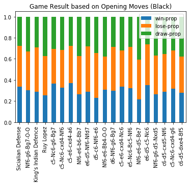

## Professional Chess

The goal of this project is to visualize the results of chess matches based off of elo differences (elo is a ranking, higher number = better player). The first graph shows the elo difference vs the game length and visualizes the winner. The other graphs show the frequency and success of opening moves for all players. We also show graphs of opening moves for players above the grand master status.

### Graphs

